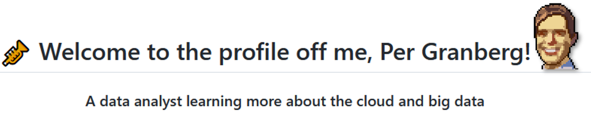

<!--
<h1 align="center">🎺 Welcome to the profile of me, Per Granberg! 🌞 
<h3 align="center">A data analyst learning more about the cloud and big data</h3>
</h1>
-->

## About me

I am interested in learning and develop more into data engineering and database management! I have a great understanding on how to analyze and manage data using **Python, R, SQL and Excel VBA.**

But the things that I have a passion for now is ETL pipelines, data in the cloud and learning Scala and Java. 

- One of the big projects I have been working on lately is to develop an entire ETL pipeline by web scraping Fanfiction data and store the data in a database. I have been using Redshift in AWS but also a PostgreSQL database so I can try different approaches on each database. I also used Airflow and AWS Lambda to automatically download the data.

- 📖 I’m currently learning **AWS, Glue, Scala and Java**

[comment]: <> (Link for themes for stats: https://github.com/anuraghazra/github-readme-stats/blob/master/themes/README.md)
<!---  --->

 

**Most used languages on Github:**

# Fanfiction project with Airflow and PostgreSQL and AWS

This is a very fun project that showcase some of my knowledge about database, sql, Airflow and AWS. A short summery is that I web scrape fanfiction data and calculate KPIs using two different methods. 
**This project can be viewed here:** [Fanfiction project](https://github.com/pergran1/Airflow-fanfiction-get-data-and-KPIs)

 

### Endpoint for dirty text classification and Streamlit app

Another side project I did using the fanfiction data was to create a classification **endpoint** and **Streamlit app** that classify if a text is sexual, which hypothetical could be used to prevent children from reading messages or texts that seems to contain sexual meaning.

**The endpoint is here:** [endpoint classification](https://dirty-text-classification.herokuapp.com/docs#/)

**The streamlit app is here:**[Streamlit app for text classification](https://pergran1-streamlit-app-for-text-classification-app-8asu6b.streamlitapp.com/)

# Dashboards made using R and Flexdashboards

The two links below are to dashboards created in **R** 👨‍💻 using the packages **Shiny and Flexdashboard**. I have a huge experience with creating dashbords with **Superset, Qlik and data studio**

### [Tweets about the Swedish Tax Agency, “Skatteverket”](https://pergranberg.shinyapps.io/skvtwitter1/)

One of my first workplaces was at the Swedish tax agency. I was intrested in extracting how the swedish people write about the tax agency, would it be with hate? love? satisfaction? scandals? 

I used Python and R in this project. Python was used to download around 42 000 old tweets that mentions “Skatteverket”, I was able to do this by using the package [GetOldTweets3](https://pypi.org/project/GetOldTweets3/) in Python.

I used R and the package Rtweet to download data from the official account of Skatteverket. Rtweet can download every tweet from a twitter account and was therefore perfect to use when analyzing the account of Skatteverket.

### [Figure Skating](https://pergranberg.shinyapps.io/testarskate/)
<!---   --->

One of friends was active in figure skating and I noticed that he was on a [website](http://www.rinkresults.com/list-skaters) that have much data concerning multiple figure skating competitions and competitors. So I figured it would be fun to use Python to scrape the data and vizulise it in a dashboard. 

This project is very sentimental to me becuase it was the first one where I used Python to webscrape and I remeber how fun it was to see and collect data from a website! So this is where it all started ☺️

# Projects analyzing data with **R**
These are some of the procjects that I made some years ago in R. These projects bring back fun memories 

[Lund University and the data of published theses](https://pergranberg.netlify.app/post/lund/)  
The fantastic and fun Lund University was where I studied my master in finance and also statistics. In this project I collected the data from [this website](https://lup.lub.lu.se/student-papers/search/student-papers/search/publication?limit=10&sort=year.desc) which have every theses made by students. I analyzed topics such as how many papers are published each year, how many authors are there, which faculty produces the most papers etc. **The plots and project is not refined**, I was going to go back and make it better but it never happend.

[Trends and Analysis of Suicide from WHO](https://pergranberg.netlify.app/post/suicidedata/)  
Here I analyzed public data on suicides taken from WHO. It was one intresting topic which is always relevant. Learned a lot about making plots. 

[Analyzing the Rise and Trends of Japanese Anime](https://pergranberg.netlify.app/post/anime/)  
By using public data from Kaggle I analyzed data concerning users that watch anime, which is japanese cartoons. 

[Who Plays and Makes Levels in the Nintendo Game Mario Maker?](https://pergranberg.netlify.app/post/mario-maker-analysis/)  
I grow up playing Nintendo games so of course I had to analyze data for the game Mario Maker, which lets the players create their own levels! This was a very fun excercise with data wrangling

[Classifying bank customers with Log, Net and Tree](https://pergranberg.netlify.app/post/bankmarketing/)  
This was a short project made in Lund University, my task was to try different approaches to classify customers that would default loans. The data is public and was taken from Kaggle. 
